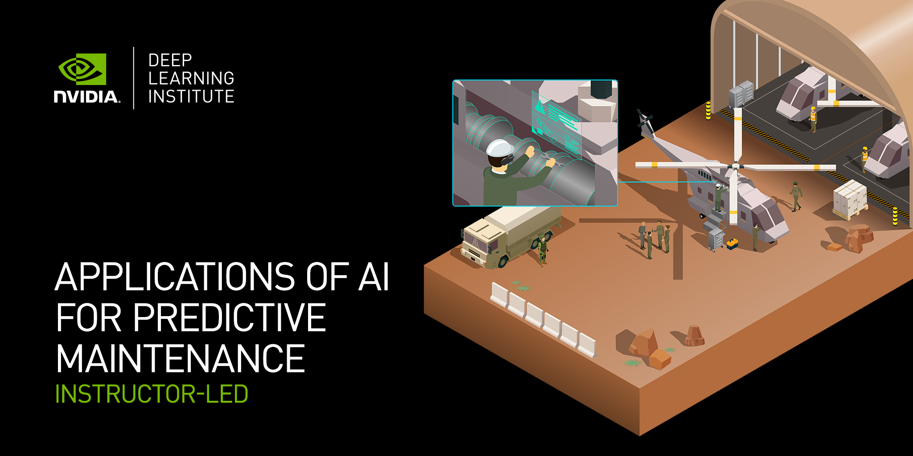

## Table of Contents
1. [Description](#description)
2. [Information](#information)
3. [File descriptions](#files)
4. [Certificate](#certificate)

## Description

According to the International Society of Automation, $647 billion is lost globally each year due to downtime from machine failure. Organizations across manufacturing, aerospace, energy, and other industrial sectors are overhauling maintenance processes to minimize costs and improve efficiency. With artificial intelligence and machine learning, organizations can apply predictive maintenance to their operation, processing huge amounts of sensor data to detect equipment failure before it happens. Compared to routine-based or time-based preventative maintenance, predictive maintenance gets ahead of the problem and can save a business from costly downtime.

In this workshop, we learned how to identify anomalies and failures in time-series data, estimate the remaining useful life of the corresponding parts, and map anomalies to failure conditions. More specifically, how to prepare time-series data for AI model training, develop an XGBoost ensemble tree model, build a deep learning model using a long short-term memory (LSTM) network, and create an autoencoder that detects anomalies for predictive maintenance. At the end of the workshop, we are able to use AI to estimate the condition of equipment and predict when maintenance should be performed.

## Information

The overall goals of this course were the following:
> - use AI-based predictive maintenance to prevent failures and unplanned downtimes;
> - identify key challenges around detecting anomalies that can lead to costly breakdowns;
> - use time-series data to predict outcomes with XGBoost-based machine learning classification models;
> - use an LSTM-based model to predict equipment failure;
> - use anomaly detection with time-series autoencoders to predict failures when limited failure-example data is available.

More detailed information and links for the course can be found on the [course website](https://www.nvidia.com/en-us/training/instructor-led-workshops/predictive-maintenance/).

## File descriptions

The description of the files in this repository can be found bellow:
- [Lab1-XGBoost-For-Timeseries](https://github.com/HROlive/Applications-of-AI-for-Predictive-Maintenance/blob/main/Lab1-XGBoost-For-Timeseries.ipynb) - Training XGBoost Models with RAPIDS for Time Series;
- [Lab1-Presentation_202208](https://github.com/HROlive/Applications-of-AI-for-Predictive-Maintenance/blob/main/Lab1-Presentation_202208.pptx) - Training XGBoost Models with RAPIDS for Time Series (Slides);
- [Lab2-LSTM-For-Timeseries](https://github.com/HROlive/Applications-of-AI-for-Predictive-Maintenance/blob/main/Lab2-LSTM-For-Timeseries.ipynb) - Training LSTM Models Using Keras and TensorFlow for Time Series;
- [Lab2-Presentation_202208](https://github.com/HROlive/Applications-of-AI-for-Predictive-Maintenance/blob/main/Lab2-Presentation_202208.pptx) - Training LSTM Models Using Keras and TensorFlow for Time Series (Slides);
- [Lab3-AE-For-Anomaly-Detection](https://github.com/HROlive/Applications-of-AI-for-Predictive-Maintenance/blob/main/Lab3-AE-For-Anomaly-Detection.ipynb) - Training Autoencoders for Anomaly Detection;
- [Lab3-Presentation_202208](https://github.com/HROlive/Applications-of-AI-for-Predictive-Maintenance/blob/main/Lab3-Presentation_202208.pptx) - Training Autoencoders for Anomaly Detection (Slides);
- [assignment](https://github.com/HROlive/Applications-of-AI-for-Predictive-Maintenance/blob/main/assignment.py) - Training Autoencoders for Anomaly Detection (Assessement);

## Certificate

The certificate for the workshop can be found bellow:

["Applications of AI for Predictive Maintenance" - NVIDIA Deep Learning Institute](https://courses.nvidia.com/certificates/31be2d89f30849a897475cb4206aaf64/) (Issued On: January 2023)
